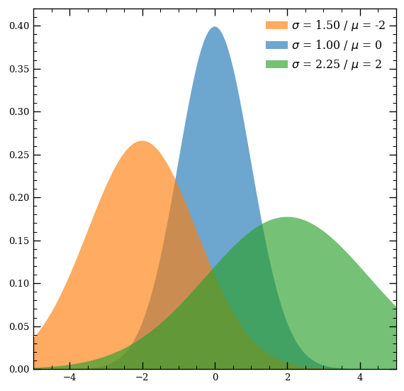

# mpl-supermongo

*mpl-supermongo* is a style sheet for [Matplotlib](https://matplotlib.org/) that emulates the plotting style of [Supermongo](https://www.astro.princeton.edu/~rhl/sm/). You can use it by downloading the file `supermongo.mplstyle` to your current working directory and pointing Matplotlib to it:

    import matplotlib.pyplot as plt
    plt.style.use("supermongo.mplstyle")

If you would rather like to reuse the style, another way is to place the file inside your `~/.config/matplotlib/mpl_configdir/stylelib` directory. If `mpl_configdir/stylelib` is not present, you may need to create it. Finally, the easiest way is to just point `plt.style.use()` to the style sheet in this repo:

    import matplotlib.pyplot as plt
    plt.style.use("https://github.com/nechoventsi/mpl-supermongo/blob/master/supermongo.mplstyle")

The main influence for this style sheet was [Monica L. Turner's guide](http://www.turnermoni.ca/python3.html) for emulating SM with Matplotlib, where I have added a few things of my own.

## Example

*mpl-supermongo* saves figures in PDF format by default and also makes the figure face (surrounding the plot) transparent.

## License

MIT License

Copyright (c) 2019 Ventsislav V. Dimitrov

Permission is hereby granted, free of charge, to any person obtaining a copy
of this software and associated documentation files (the "Software"), to deal
in the Software without restriction, including without limitation the rights
to use, copy, modify, merge, publish, distribute, sublicense, and/or sell
copies of the Software, and to permit persons to whom the Software is
furnished to do so, subject to the following conditions:

The above copyright notice and this permission notice shall be included in all
copies or substantial portions of the Software.

THE SOFTWARE IS PROVIDED "AS IS", WITHOUT WARRANTY OF ANY KIND, EXPRESS OR
IMPLIED, INCLUDING BUT NOT LIMITED TO THE WARRANTIES OF MERCHANTABILITY,
FITNESS FOR A PARTICULAR PURPOSE AND NONINFRINGEMENT. IN NO EVENT SHALL THE
AUTHORS OR COPYRIGHT HOLDERS BE LIABLE FOR ANY CLAIM, DAMAGES OR OTHER
LIABILITY, WHETHER IN AN ACTION OF CONTRACT, TORT OR OTHERWISE, ARISING FROM,
OUT OF OR IN CONNECTION WITH THE SOFTWARE OR THE USE OR OTHER DEALINGS IN THE
SOFTWARE.
